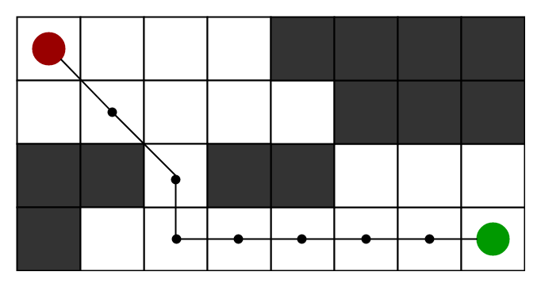
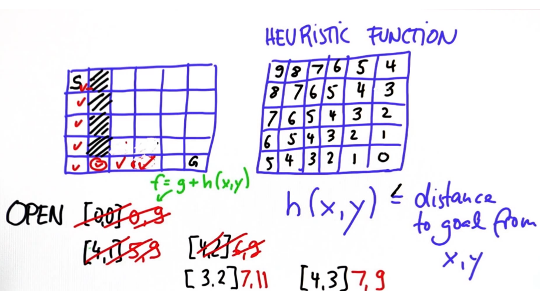
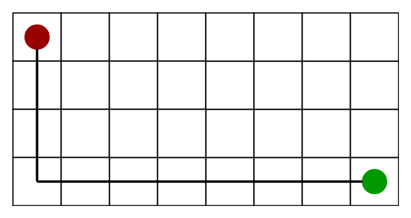
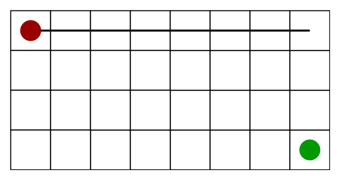

<html><head><meta content="text/html; charset=UTF-8" http-equiv="content-type"
</head><body class="c36 c40"><h1 class="c29" id="h.4x7mhf1lphco">A* Search Algorithm</h1><h2 class="c22" id="h.edzewasqhh13">Intro:</h2><ol class="c34 lst-kix_yhbzk0mr0rox-0 start" start="1"><li class="c2 c37">What is the easiest path to get to the goal destination in a map or game puzzle game?</li></ol>

A* Search Algorithm&nbsp;is one of the best descrite technique used in path-finding and graph traversals.
<h2 class="c22" id="h.pcxdvtp64q77">How it works?</h2>
At each step it picks the node/cell with the lowest &lsquo;f&rsquo;.

&lsquo;f&rsquo; is is a parameter equal to the sum of &lsquo;g&rsquo; and &lsquo;h&rsquo;. 

g&nbsp;= the movement cost to move from the starting point to a given square on the grid, following the path generated to get there.

h&nbsp;= the estimated movement cost/distance to the final destination. This is often referred to as the&nbsp;heuristic.

&nbsp;
<h2 class="c21" id="h.nc9nvpskr34f">Pseudocode&nbsp;Code:</h2><table class="c0"><tbody><tr class="c42"><td class="c52" colspan="1" rowspan="1">
// A* Search Algorithm 1.&nbsp; Initialize the open list 2.&nbsp; Initialize the closed list  &nbsp; &nbsp;put the starting node on the open   &nbsp; &nbsp;list (you can leave its f at zero)  3.&nbsp; while&nbsp;the open list is&nbsp;not&nbsp;empty  &nbsp; &nbsp;a) find the node with&nbsp;the least f on   &nbsp; &nbsp; &nbsp; the open list, call it &quot;q&quot;   &nbsp; &nbsp;b) pop q off the open list  &nbsp;  &nbsp; &nbsp;c) generate q&#39;s 8 successors and set their   &nbsp; &nbsp; &nbsp; parents to q  &nbsp;   &nbsp; &nbsp;d) for each successor  &nbsp; &nbsp; &nbsp; &nbsp;i) if successor is the goal, stop search  &nbsp; &nbsp; &nbsp; &nbsp; &nbsp;successor.g = q.g + distance between   &nbsp; &nbsp; &nbsp; &nbsp; &nbsp; &nbsp; &nbsp; &nbsp; &nbsp; &nbsp; &nbsp; &nbsp; &nbsp; &nbsp; &nbsp;successor and q  &nbsp; &nbsp; &nbsp; &nbsp; &nbsp;successor.h = distance from goal to   &nbsp; &nbsp; &nbsp; &nbsp; &nbsp;successor (This can be done using many   &nbsp; &nbsp; &nbsp; &nbsp; &nbsp;ways, we will discuss three heuristics-   &nbsp; &nbsp; &nbsp; &nbsp; &nbsp;Manhattan, Diagonal and Euclidean   &nbsp; &nbsp; &nbsp; &nbsp; &nbsp;Heuristics)  &nbsp; &nbsp; &nbsp; &nbsp; &nbsp;  &nbsp; &nbsp; &nbsp; &nbsp; &nbsp;successor.f = successor.g + successor.h   &nbsp; &nbsp; &nbsp; &nbsp;ii) if a node with the same position as   &nbsp; &nbsp; &nbsp; &nbsp; &nbsp; &nbsp;successor is in the OPEN list which has a   &nbsp; &nbsp; &nbsp; &nbsp; &nbsp; lower f than successor, skip this successor   &nbsp; &nbsp; &nbsp; &nbsp;iii) if a node with the same position as   &nbsp; &nbsp; &nbsp; &nbsp; &nbsp; &nbsp;successor &nbsp;is in the CLOSED list which has  &nbsp; &nbsp; &nbsp; &nbsp; &nbsp; &nbsp;a lower f than successor, skip this successor  &nbsp; &nbsp; &nbsp; &nbsp; &nbsp; &nbsp;otherwise, add &nbsp;the node to the open list  &nbsp; &nbsp; end (for loop)  &nbsp;  &nbsp; &nbsp;e) push q on the closed list  &nbsp; &nbsp;end (while loop)
</td></tr></tbody></table>
&nbsp;

<h2 class="c22" id="h.77j56254e6ht">How to calculate calculate heuristic&nbsp;(cost/distance to the final destination). </h2><h3 class="c11" id="h.glgqzkji50xu">A) Exact Heuristics &ndash;</h3>
We can find exact values of h, but that is generally very time consuming. Below are some of the methods to calculate the exact value of h:
<ul class="c34 lst-kix_z8qcvrca9jt9-0 start"><li class="c28 c37">Pre-compute the distance between each pair of cells before running the A* Search Algorithm.</li><li class="c28 c37">If there are no blocked cells/obstacles then we can just find the exact value of h without any pre-computation using the <a class="c27" href="https://www.google.com/url?q=https://en.wikipedia.org/wiki/Euclidean_distance&amp;sa=D&amp;ust=1518400635603000&amp;usg=AFQjCNHm-dL3JXVqZtmzT1ZnHAV6Xr315A">distance formula/Euclidean Distance</a></li></ul><h3 class="c54" id="h.9epl0hu2trmw">B) Approximation Heuristics Methods&ndash;</h3>

<table class="c0"><tbody><tr class="c30"><td class="c19" colspan="2" rowspan="1"><h2 class="c22 c46" id="h.wthfi0m0uzxb">1) Manhattan Distance</h2></td></tr><tr class="c39"><td class="c20" colspan="1" rowspan="1">
Is the sum of absolute values of differences in the goal&rsquo;s x and y coordinates and the current cell&rsquo;s x and y coordinates respectively, i.e.,. &nbsp;Manhattan Distance can only be used when we are allowed to move only in four directions only (right, left, top, bottom)

<table class="c0"><tbody><tr class="c42"><td class="c15" colspan="1" rowspan="1">
h = abs (current_cell.x - goal.x) &nbsp;+ &nbsp;abs (current_cell.y - goal.y)
</td></tr></tbody></table>

</td><td class="c20" colspan="1" rowspan="1">

</td></tr></tbody></table>

<table class="c0"><tbody><tr class="c30"><td class="c19" colspan="2" rowspan="1"><h2 class="c22 c46" id="h.j4rez31kuemr">2) Diagonal Distance</h2></td></tr><tr class="c39"><td class="c20" colspan="1" rowspan="1">
The maximum of absolute values of differences in the goal&rsquo;s x and y coordinates and the current cell&rsquo;s x and y coordinates respectively, i.e.,. 

Use case: When we are allowed to move in eight directions only (similar to a move of a King in Chess)
<table class="c0"><tbody><tr class="c42"><td class="c15" colspan="1" rowspan="1">
h = max { abs(current_cell.x - goal.x), &nbsp;abs(current_cell.y - goal.y) }
</td></tr></tbody></table>

</td><td class="c20" colspan="1" rowspan="1">

</td></tr></tbody></table>

<table class="c0"><tbody><tr class="c30"><td class="c19" colspan="2" rowspan="1"><h3 class="c11 c46" id="h.w3znk26w4avv">3) Euclidean Distance</h3></td></tr><tr class="c39"><td class="c20" colspan="1" rowspan="1">
As it is clear from its name, it is nothing but the distance between the current cell and the goal cell using the distance formula. 

Use case: When we are allowed to move in any directions.
<table class="c0"><tbody><tr class="c42"><td class="c15" colspan="1" rowspan="1">
h = sqrt ( (current_cell.x - goal.x)2&nbsp;+ &nbsp;(current_cell.y - goal.y)2&nbsp;)
</td></tr></tbody></table>

</td><td class="c20" colspan="1" rowspan="1">

</td></tr></tbody></table>

<h1 class="c47" id="h.w34g9bu8fadn">Hybrid A* Pseudocode:</h1>
The following variables and objects are used in the code bellow:
<ul class="c34 lst-kix_kgftrmlk3obq-0 start"><li class="c5">State(x, y, theta, g, f): An object which stores x, y&nbsp;coordinates, direction theta, and current g&nbsp;and f values. grid: A 2D array of 0s and 1s indicating the area to be searched. 1s correspond to obstacles, and 0s correspond to free space.</li><li class="c5">SPEED: The speed of the vehicle used in the bicycle model.</li><li class="c5">LENGTH: The length of the vehicle used in the bicycle model.</li><li class="c5">NUM_THETA_CELLS: The number of cells a circle is divided into. This is used in keeping track of which States we have visited already.</li></ul>
The search&nbsp;function contains the bulk of the hybrid A* algorithm

The expand&nbsp;function takes a state and goal as inputs and returns a list of possible next states for a range of steering angles. 
<table class="c0"><tbody><tr class="c42"><td class="c52" colspan="1" rowspan="1">
def&nbsp;expand(state, goal):  &nbsp; &nbsp;next_states = []  &nbsp; &nbsp;for&nbsp;delta in&nbsp;range(-35, 40, 5):   &nbsp; &nbsp; &nbsp; &nbsp;# Create a trajectory with delta as the steering angle using the bicycle model:   &nbsp; &nbsp; &nbsp; &nbsp;# ---Begin bicycle model---  &nbsp; &nbsp; &nbsp; &nbsp;delta_rad = deg_to_rad(delta)  &nbsp; &nbsp; &nbsp; &nbsp;omega = SPEED/LENGTH * tan(delta_rad)  &nbsp; &nbsp; &nbsp; &nbsp;next_x = state.x + SPEED * cos(theta)  &nbsp; &nbsp; &nbsp; &nbsp;next_y = state.y + SPEED * sin(theta)  &nbsp; &nbsp; &nbsp; &nbsp;next_theta = normalize(state.theta + omega)  &nbsp; &nbsp; &nbsp; &nbsp;# ---End bicycle model-----   &nbsp; &nbsp; &nbsp; &nbsp;next_g = state.g + 1  &nbsp; &nbsp; &nbsp; &nbsp;next_f = next_g + heuristic(next_x, next_y, goal)   &nbsp; &nbsp; &nbsp; &nbsp;# Create a new State object with all of the &quot;next&quot; values.  &nbsp; &nbsp; &nbsp; &nbsp;state = State(next_x, next_y, next_theta, next_g, next_f)  &nbsp; &nbsp; &nbsp; &nbsp;next_states.append(state)   &nbsp; &nbsp;return&nbsp;next_states  def&nbsp;search(grid, start, goal):  &nbsp; &nbsp;# The opened array keeps track of the stack of States objects we are   &nbsp; &nbsp;# searching through.  &nbsp; &nbsp;opened = []  &nbsp; &nbsp;# 3D array of zeros with dimensions:  &nbsp; &nbsp;# (NUM_THETA_CELLS, grid x size, grid y size).  &nbsp; &nbsp;closed = [[[0&nbsp;for&nbsp;x in&nbsp;range(grid[0])] for&nbsp;y in&nbsp;range(len(grid))] for&nbsp;cell in&nbsp;range(NUM_THETA_CELLS)]  &nbsp; &nbsp;# 3D array with same dimensions. Will be filled with State() objects to keep   &nbsp; &nbsp;# track of the path through the grid.   &nbsp; &nbsp;came_from = [[[0&nbsp;for&nbsp;x in&nbsp;range(grid[0])] for&nbsp;y in&nbsp;range(len(grid))] for&nbsp;cell in&nbsp;range(NUM_THETA_CELLS)]   &nbsp; &nbsp;# Create new state object to start the search with.  &nbsp; &nbsp;x = start.x  &nbsp; &nbsp;y = start.y  &nbsp; &nbsp;theta = start.theta  &nbsp; &nbsp;g = 0  &nbsp; &nbsp;f = heuristic(start.x, start.y, goal)  &nbsp; &nbsp;state = State(x, y, theta, 0, f)  &nbsp; &nbsp;opened.append(state)   &nbsp; &nbsp;# The range from 0 to 2pi has been discretized into NUM_THETA_CELLS cells.   &nbsp; &nbsp;# Here, theta_to_stack_number returns the cell that theta belongs to.   &nbsp; &nbsp;# Smaller thetas (close to 0 when normalized &nbsp;into the range from 0 to 2pi)   &nbsp; &nbsp;# have lower stack numbers, and larger thetas (close to 2pi when normalized)  &nbsp; &nbsp;# have larger stack numbers.  &nbsp; &nbsp;stack_number = theta_to_stack_number(state.theta)  &nbsp; &nbsp;closed[stack_number][index(state.x)][index(state.y)] = 1   &nbsp; &nbsp;# Store our starting state. For other states, we will store the previous state   &nbsp; &nbsp;# in the path, but the starting state has no previous.  &nbsp; &nbsp;came_from[stack_number][index(state.x)][index(state.y)] = state   &nbsp; &nbsp;# While there are still states to explore:  &nbsp; &nbsp;while&nbsp;opened:  &nbsp; &nbsp; &nbsp; &nbsp;# Sort the states by f-value and start search using the state with the   &nbsp; &nbsp; &nbsp; &nbsp;# lowest f-value. This is crucial to the A* algorithm; the f-value   &nbsp; &nbsp; &nbsp; &nbsp;# improves search efficiency by indicating where to look first.  &nbsp; &nbsp; &nbsp; &nbsp;opened.sort(key=lambda&nbsp;state:state.f)  &nbsp; &nbsp; &nbsp; &nbsp;current = opened.pop(0)   &nbsp; &nbsp; &nbsp; &nbsp;# Check if the x and y coordinates are in the same grid cell as the goal.   &nbsp; &nbsp; &nbsp; &nbsp;# (Note: The idx function returns the grid index for a given coordinate.)  &nbsp; &nbsp; &nbsp; &nbsp;if&nbsp;(idx(current.x) == goal[0]) and&nbsp;(idx(current.y) == goal.y):  &nbsp; &nbsp; &nbsp; &nbsp; &nbsp; &nbsp;# If so, the trajectory has reached the goal.  &nbsp; &nbsp; &nbsp; &nbsp; &nbsp; &nbsp;return&nbsp;path   &nbsp; &nbsp; &nbsp; &nbsp;# Otherwise, expand the current state to get a list of possible next states.  &nbsp; &nbsp; &nbsp; &nbsp;next_states = expand(current, goal)  &nbsp; &nbsp; &nbsp; &nbsp;for&nbsp;next_state in&nbsp;next_states:  &nbsp; &nbsp; &nbsp; &nbsp; &nbsp; &nbsp;# If we have expanded outside the grid, skip this next_state.  &nbsp; &nbsp; &nbsp; &nbsp; &nbsp; &nbsp;if&nbsp;next_states is&nbsp;not&nbsp;in&nbsp;the grid:  &nbsp; &nbsp; &nbsp; &nbsp; &nbsp; &nbsp; &nbsp; &nbsp;continue  &nbsp; &nbsp; &nbsp; &nbsp; &nbsp; &nbsp;# Otherwise, check that we haven&#39;t already visited this cell and  &nbsp; &nbsp; &nbsp; &nbsp; &nbsp; &nbsp;# that there is not an obstacle in the grid there.  &nbsp; &nbsp; &nbsp; &nbsp; &nbsp; &nbsp;stack_number = theta_to_stack_number(next_state.theta)  &nbsp; &nbsp; &nbsp; &nbsp; &nbsp; &nbsp;if&nbsp;closed_value[stack_number][idx(next_state.x)][idx(next_state.y)] == 0&nbsp;and&nbsp;grid[idx(next_state.x)][idx(next_state.y)] == 0:  &nbsp; &nbsp; &nbsp; &nbsp; &nbsp; &nbsp; &nbsp; &nbsp;# The state can be added to the opened stack.  &nbsp; &nbsp; &nbsp; &nbsp; &nbsp; &nbsp; &nbsp; &nbsp;opened.append(next_state)  &nbsp; &nbsp; &nbsp; &nbsp; &nbsp; &nbsp; &nbsp; &nbsp;# The stack_number, idx(next_state.x), idx(next_state.y) tuple   &nbsp; &nbsp; &nbsp; &nbsp; &nbsp; &nbsp; &nbsp; &nbsp;# has now been visited, so it can be closed.  &nbsp; &nbsp; &nbsp; &nbsp; &nbsp; &nbsp; &nbsp; &nbsp;closed[stack_number][idx(next_state.x)][idx(next_state.y)] = 1  &nbsp; &nbsp; &nbsp; &nbsp; &nbsp; &nbsp; &nbsp; &nbsp;# The next_state came from the current state, and that is recorded.  &nbsp; &nbsp; &nbsp; &nbsp; &nbsp; &nbsp; &nbsp; &nbsp;came_from[stack_number][idx(next_state.x)][idx(next_state.y)] = current
</td></tr></tbody></table>

<h3 class="c11" id="h.tfuv1fbsza1s">Reference :</h3>
Udacity Self-Driving Car 

<a class="c27" href="https://www.google.com/url?q=https://www.geeksforgeeks.org/a-search-algorithm/&amp;sa=D&amp;ust=1518400635616000&amp;usg=AFQjCNEgJ__Q0eXVfJCrHOPP8F_RuGQvjw">geeksforgeeks</a>

<a class="c27" href="https://www.google.com/url?q=https://d17h27t6h515a5.cloudfront.net/topher/2017/July/595fe838_junior-the-stanford-entry-in-the-urban-challenge/junior-the-stanford-entry-in-the-urban-challenge.pdf&amp;sa=D&amp;ust=1518400635617000&amp;usg=AFQjCNEt7J6kRYoiC8uIzg4cCAJuB2cwxQ">Junior: The Stanford Entry in the Urban Challenge</a>
</body></html>