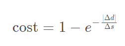
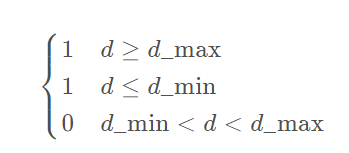

<html><head><meta content="text/html; charset=UTF-8" http-equiv="content-type">
</head><body class="c30">
Behavior Planning
<h2 class="c27" id="h.edzewasqhh13">Intro:</h2>
In this code above cover self driving car states machines:
<ol class="c13 lst-kix_yhbzk0mr0rox-0 start" start="1"><li class="c0 c6">Keep lane</li><li class="c0 c6">Change Lane right</li><li class="c0 c6">Prep lane change left</li><li class="c0 c6">Prep lane change right </li><li class="c0 c6">Change lane left</li></ol>

<h2 class="c11" id="h.fqyoliujax40">Cost function:</h2><h2 class="c11" id="h.lnp0d3dc6tb2">To help our decision making on what state to transit we generally use cost functions. Cost functions allow us to penalise bad transitions and to reward good posible transactions. Example:</h2>

Goald Distance Cost -Cost Increases based on distance of intended lane (for planning a lane change) and final lane of trajectory. Cost of being out of the goal lane becomes larger as vehicle approaches goal distance.

<table class="c19"><tbody><tr class="c31"><td class="c23" colspan="1" rowspan="1">

</td><td class="c33" colspan="1" rowspan="1"><ul class="c13 lst-kix_nopw90j1nuel-0 start"><li class="c0 c6">&Delta;d&nbsp;was the lateral distance between the goal lane and the final chosen lane</li><li class="c0 c6">&Delta;s&nbsp;was the longitudinal distance from the vehicle to the goal.</li></ul></td></tr></tbody></table>

Cost Code Example:
<table class="c19"><tbody><tr class="c31"><td class="c24" colspan="1" rowspan="1">
&nbsp; &nbsp;int&nbsp;delta_d = 2.0&nbsp;* goal_lane - intended_lane - final_lane;  &nbsp; float&nbsp;cost = 1&nbsp;- exp(-(abs(delta_d) / distance_to_goal));  &nbsp; return&nbsp;cost;
</td></tr></tbody></table>
Cost Table implemented: 
<table class="c19"><tbody><tr class="c31"><td class="c22" colspan="1" rowspan="1">
Penalizes trajectories that attempt to accelerate at a rate which is not possible for the vehicle.
</td><td class="c2" colspan="1" rowspan="1">
Penalizes trajectories that drive off the road.
</td></tr><tr class="c31"><td class="c22" colspan="1" rowspan="1">
Penalizes trajectories that exceed the speed limit.

</td><td class="c2" colspan="1" rowspan="1">
Penalizes trajectories that do not stay near the center of the lane.

</td></tr><tr class="c38"><td class="c37" colspan="2" rowspan="1">

Rewards trajectories that stay near the target lane.

</td></tr></tbody></table>

</body></html>