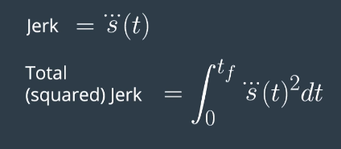
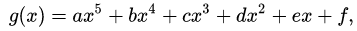
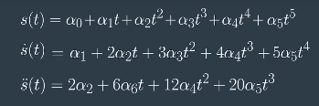
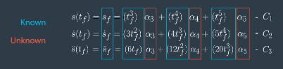
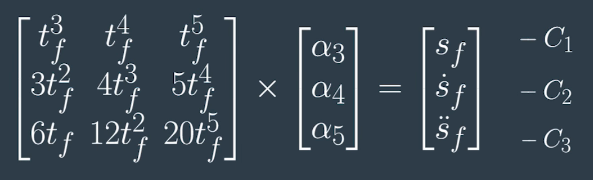
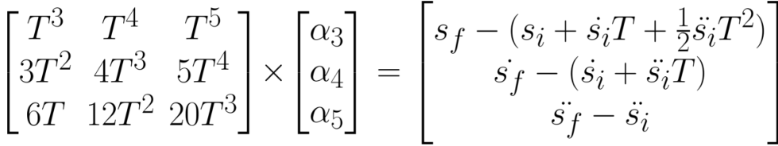

<html><head><meta content="text/html; charset=UTF-8" http-equiv="content-type">
</head><body class="c26"><h1 class="c30" id="h.p1oh57ghykfu">Jerk Minimizing Algorithm for Trajectories Generation</h1>

<h2 class="c27" id="h.ea1qusovzbl1">Overview:</h2><ul class="c33 lst-kix_vocg9dsh5o45-0 start"><li class="c6 c22">Apply a quintic polynomial solver in C++ to&nbsp;minimize Jerk motion in a self-driving car</li></ul><h2 class="c27" id="h.ur29a8y3rbxd">Intro:</h2>
I order to have continuous trajectories we need to minimize Jerk movement. 

Jerk is the 3rd derivative of position.

Because we would like to penalize negative and positive jerk we are using total square jerk. 

To obtain minimum the minimum jerk all coefficients greater than 6 &nbsp;should be zero. Which means all order of transitions can be represented by a quintic function. 

A quintic function is defined by a <a class="c12" href="https://www.google.com/url?q=https://en.wikipedia.org/wiki/Polynomial&amp;sa=D&amp;ust=1518332645299000&amp;usg=AFQjCNEtcVKa6uz7mtLG3TuBY3S0-uLlXw">polynomial</a>&nbsp;of <a class="c12" href="https://www.google.com/url?q=https://en.wikipedia.org/wiki/Degree_of_a_polynomial&amp;sa=D&amp;ust=1518332645299000&amp;usg=AFQjCNGkvSU7lUTL7Hd1PzceYkmZ9Jdb0w">degree</a>&nbsp;five. Where a, b, c, d, e,&nbsp;and f&nbsp;are coefficients that we can choose to define the motion of our vehicle.

In this case we would be using:

[Si, Si&rsquo;, Si&rsquo;&rsquo;, Sf, Sf&rsquo;, Sf&rsquo;&rsquo;]
<table class="c9"><tbody><tr class="c29"><td class="c7" colspan="1" rowspan="1">
S &nbsp;= POSITION

S&rsquo; = SPEED

S&rsquo;&rsquo; = ACCELERATION

i = INITIAL

f = FINAL
</td><td class="c21" colspan="1" rowspan="1">

</td></tr><tr class="c14"><td class="c7" colspan="1" rowspan="2">
Because we now our parameters [Si, Si&rsquo;, Si&rsquo;&rsquo;, Sf, Sf&rsquo;, Sf&rsquo;&rsquo;] at time zero and at final time, We can simplify this system of equations know and unowns. And then, to a matrix that looks like this.
</td><td class="c21" colspan="1" rowspan="1">

</td></tr><tr class="c14"><td class="c21" colspan="1" rowspan="1">

</td></tr><tr class="c14"><td class="c34" colspan="2" rowspan="1">

</td></tr></tbody></table>

Using Eiger this is the implementation in C++ (main.cpp ln37-59):

<table class="c9"><tbody><tr class="c29"><td class="c8" colspan="1" rowspan="1">
vector&lt;double&gt; JMT(vector&lt; double&gt; start, vector &lt;double&gt; end, double T) {  &nbsp; MatrixXd A = MatrixXd(3, 3); &nbsp;&nbsp;&nbsp;&nbsp;&nbsp;&nbsp;&nbsp;&nbsp;A &lt;&lt; T*T*T, T*T*T*T, T*T*T*T*T, &nbsp;&nbsp;&nbsp;&nbsp;&nbsp;&nbsp;&nbsp;&nbsp;&nbsp;&nbsp;&nbsp;&nbsp;&nbsp;&nbsp;&nbsp;&nbsp;&nbsp;&nbsp;&nbsp;&nbsp;&nbsp;&nbsp;&nbsp;&nbsp; &nbsp; &nbsp;3*T*T, 4*T*T*T,5*T*T*T*T, &nbsp;&nbsp;&nbsp;&nbsp;&nbsp;&nbsp;&nbsp;&nbsp;&nbsp;&nbsp;&nbsp;&nbsp;&nbsp;&nbsp;&nbsp;&nbsp;&nbsp;&nbsp;&nbsp;&nbsp;&nbsp;&nbsp;&nbsp;&nbsp; &nbsp; &nbsp;6*T, 12*T*T, 20*T*T*T; &nbsp;&nbsp;&nbsp;&nbsp;&nbsp;&nbsp;&nbsp;&nbsp;&nbsp;&nbsp;&nbsp;&nbsp;&nbsp;&nbsp;&nbsp;&nbsp; &nbsp;&nbsp;&nbsp;&nbsp;&nbsp;&nbsp;&nbsp;&nbsp;MatrixXd B = MatrixXd(3,1);&nbsp;&nbsp;&nbsp;&nbsp;&nbsp;&nbsp;&nbsp;&nbsp; &nbsp; &nbsp; &nbsp;&nbsp;&nbsp;&nbsp;&nbsp;&nbsp;&nbsp;&nbsp;B &lt;&lt; end[0]-(start[0]+start[1]*T+.5*start[2]*T*T), &nbsp;&nbsp;&nbsp;&nbsp;&nbsp;&nbsp;&nbsp;&nbsp;&nbsp;&nbsp;&nbsp;&nbsp;&nbsp;&nbsp;&nbsp;&nbsp;&nbsp;&nbsp;&nbsp;&nbsp;&nbsp;&nbsp;&nbsp;&nbsp; &nbsp; &nbsp;end[1]-(start[1]+start[2]*T), &nbsp;&nbsp;&nbsp;&nbsp;&nbsp;&nbsp;&nbsp;&nbsp;&nbsp;&nbsp;&nbsp;&nbsp;&nbsp;&nbsp;&nbsp;&nbsp;&nbsp;&nbsp;&nbsp;&nbsp;&nbsp;&nbsp;&nbsp;&nbsp; &nbsp; &nbsp;end[2]-start[2]; &nbsp;&nbsp;&nbsp;&nbsp;&nbsp;&nbsp;&nbsp;&nbsp;&nbsp;&nbsp;&nbsp;&nbsp;&nbsp;&nbsp;&nbsp;&nbsp;&nbsp;&nbsp;&nbsp;&nbsp;&nbsp;&nbsp;&nbsp;&nbsp; &nbsp; &nbsp; &nbsp;&nbsp;&nbsp;&nbsp;&nbsp;&nbsp;&nbsp;&nbsp;MatrixXd Ai = A.inverse(); &nbsp;&nbsp;&nbsp;&nbsp;&nbsp;&nbsp;&nbsp;&nbsp; &nbsp;&nbsp;&nbsp;&nbsp;&nbsp;&nbsp;&nbsp;&nbsp;MatrixXd C = Ai*B; &nbsp;&nbsp;&nbsp;&nbsp;&nbsp;&nbsp;&nbsp;&nbsp; &nbsp;&nbsp;&nbsp;&nbsp;&nbsp;&nbsp;&nbsp;&nbsp;vector &lt;double&gt; result = {start[0], start[1], .5*start[2]}; &nbsp;&nbsp;&nbsp;&nbsp;&nbsp;&nbsp;&nbsp;&nbsp;for(int i = 0; i &lt; C.size(); i++) &nbsp;&nbsp;&nbsp;&nbsp;&nbsp;&nbsp;&nbsp;&nbsp;{ &nbsp;&nbsp;&nbsp;&nbsp;&nbsp;&nbsp;&nbsp;&nbsp; &nbsp; &nbsp;result.push_back(C.data()[i]); &nbsp;&nbsp;&nbsp;&nbsp;&nbsp;&nbsp;&nbsp;&nbsp;}  &nbsp; &nbsp;return&nbsp;result; }
</td></tr></tbody></table>

Udacity Self-Driving Car 

<a class="c12" href="https://www.google.com/url?q=https://d17h27t6h515a5.cloudfront.net/topher/2017/July/595fe838_junior-the-stanford-entry-in-the-urban-challenge/junior-the-stanford-entry-in-the-urban-challenge.pdf&amp;sa=D&amp;ust=1518332645312000&amp;usg=AFQjCNHO6u5JH_7cGiDGjn7-l_GsAc_bIw">Junior: The Stanford Entry in the Urban Challenge</a>

</body></html>