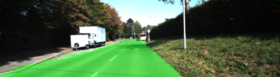
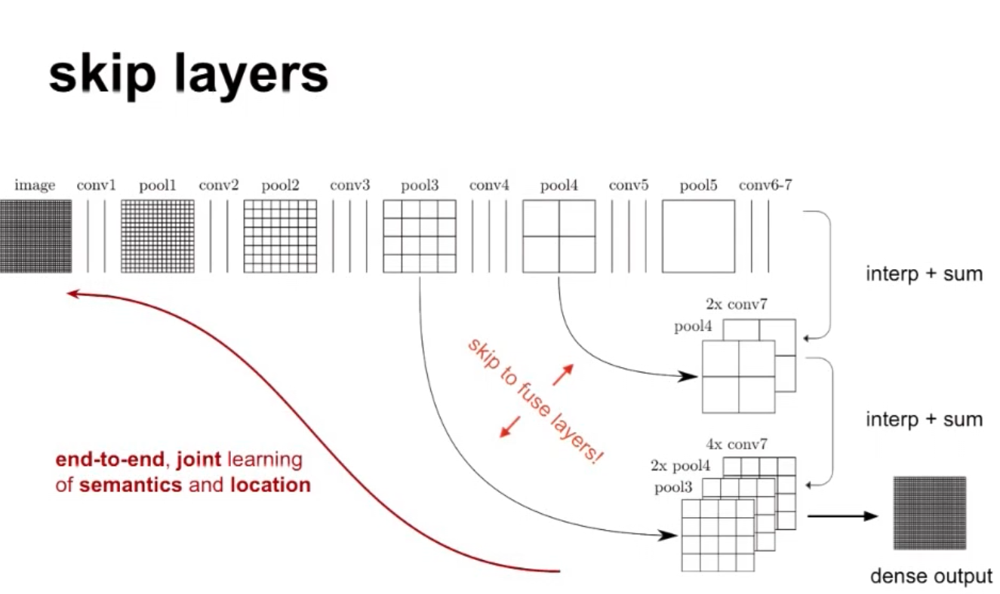
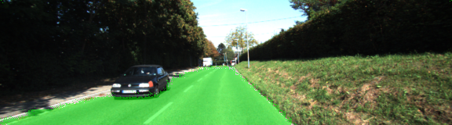
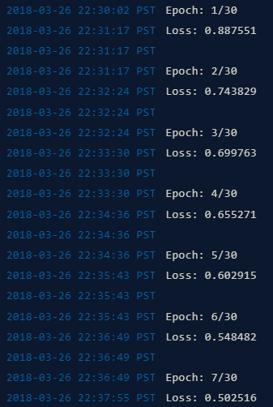
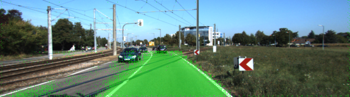
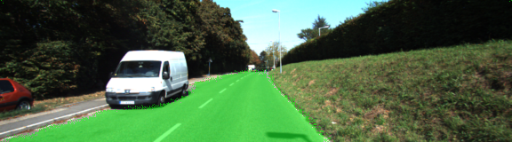
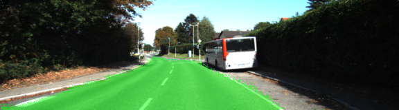
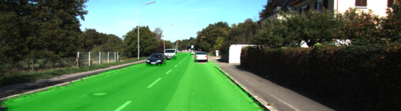
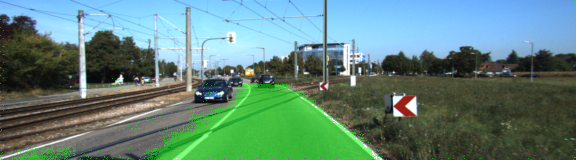

<html><head><meta content="text/html; charset=UTF-8" http-equiv="content-type"><st</head><body class="c44 c47"><h1 class="c22 c18" id="h.sl8q8y4gq0tb">CarND-Path-Planning-Project</h1><h1 class="c18 c22" id="h.3gc3ewas5i1j">Semantic Segmentation</h1><h3 class="c7" id="h.ihhrvp3uctp9"></h3><h2 class="c7" id="h.8k1oepb1840z">Introduction</h2>
The purpose of this project to segment road lanes by implementing correctly image segmentation Fully Convolutional Network (FCN) as specified in the <a class="c8" href="https://www.google.com/url?q=https://people.eecs.berkeley.edu/~jonlong/long_shelhamer_fcn.pdf&amp;sa=D&amp;ust=1522472818100000">Fully Convolutional Networks for Semantic Segmentation</a>&nbsp;paper. 
<h2 class="c18 c38" id="h.geqv5l3926o4">Summary </h2><ul class="c50 lst-kix_vx89dbfa2t45-0 start"><li class="c5 c55">In this projects I I loaded VGG16 pretrained model and finetune VGG model to do lane segmentation to human-level accuracy. </li><li class="c5 c55">Correctly combined new layers with VGG16 to construct your model.</li><li class="c5 c55">Skip connections are used from previous vgg_layer3_out and vgg_layer4_out layers. The authors of <a class="c8" href="https://www.google.com/url?q=https://people.eecs.berkeley.edu/~jonlong/long_shelhamer_fcn.pdf&amp;sa=D&amp;ust=1522472818101000">original paper</a>&nbsp;highly suggest to use these skip connections to improve segmentation accuracy.</li><li class="c5 c55">Correctly added Deconvolution or Transpose Strided layers on top of provided VGG model.</li><li class="c5 c55">Optimized graph parameters and train </li></ul>

<h2 class="c24" id="h.cdrdlyjkurgu">Below is a visualization of the projects architecture: </h2>

<h3 class="c7" id="h.ch0qbzojsdsi">Setup</h3><h3 class="c7" id="h.kmmkbog2bz1y">Frameworks and Packages</h3>
Make sure you have the following is installed:
<ul class="c50 lst-kix_1rj01lbgs74w-0 start"><li class="c10 c56"><a class="c8" href="https://www.google.com/url?q=https://www.python.org/&amp;sa=D&amp;ust=1522472818103000">Python 3</a></li><li class="c4"><a class="c8" href="https://www.google.com/url?q=https://www.tensorflow.org/&amp;sa=D&amp;ust=1522472818103000">TensorFlow</a></li><li class="c4"><a class="c8" href="https://www.google.com/url?q=http://www.numpy.org/&amp;sa=D&amp;ust=1522472818103000">NumPy</a></li><li class="c4"><a class="c8" href="https://www.google.com/url?q=https://www.scipy.org/&amp;sa=D&amp;ust=1522472818104000">SciPy</a></li></ul><h3 class="c7" id="h.h67a7u9i51oy">Dataset</h3>
Download the <a class="c8" href="https://www.google.com/url?q=http://www.cvlibs.net/datasets/kitti/eval_road.php&amp;sa=D&amp;ust=1522472818104000">Kitti Road dataset</a>&nbsp;from <a class="c8" href="https://www.google.com/url?q=http://www.cvlibs.net/download.php?file%3Ddata_road.zip&amp;sa=D&amp;ust=1522472818104000">here</a>. Extract the dataset in the data&nbsp;folder. This will create the folder data_road&nbsp;with all the training a test images.
<h2 class="c7" id="h.hu03jrh0lj2d">Run</h2>
Run the following command to run the project:

python main.py

To run this code you would need a GPU with at least 6GB of memory, because I did not have one with me I used <a class="c8" href="https://www.google.com/url?q=http://www.floydhub.com&amp;sa=D&amp;ust=1522472818106000">floyhub</a>.

To run the project under floydhub type this line in your command line after you upload your data road dataset and vgg model:

floyd run --gpu --env tensorflow-1.3 --data USERNAME/datasets/data_road/1:/data_road

--data USERNAME/datasets/pretrained_vgg/1:/pretrained_vgg &quot;python main.py&quot;

<h3 class="c18 c27" id="h.cmmowlzhwcy8">Project walk through:</h3><ol class="c50 lst-kix_b7drba6x2oxi-0 start" start="1"><li class="c25 c55"><h3 id="h.8nd9kbk7z486" style="display:inline">Load the pretrained vgg model</h3></li></ol>
Function load_vgg is implemented correctly to load (see main.py ln54). It loads the model VGG from a SavedModel as specified by &nbsp;tags &lsquo;vgg16&rsquo; and it saves it in the specified path vgg_path and with tf.get_default_graph() we get the graph with the loaded context.

<table class="c52 c18"><tbody><tr class="c36"><td class="c67" colspan="1" rowspan="1">
tf.saved_model.loader.load(sess, [&#39;vgg16&#39;], vgg_path)

graph = tf.get_default_graph()

image_input = graph.get_tensor_by_name(&#39;image_input:0&#39;)

keep_prob = graph.get_tensor_by_name(&#39;keep_prob:0&#39;)

layer3_out = graph.get_tensor_by_name(&#39;layer3_out:0&#39;)

layer4_out = graph.get_tensor_by_name(&#39;layer4_out:0&#39;)

layer7_out = graph.get_tensor_by_name(&#39;layer7_out:0&#39;)
</td></tr></tbody></table>

<h2 class="c24" id="h.ohi920t1fxhj">2. The function layers is implementation </h2>
The authors of <a class="c8" href="https://www.google.com/url?q=https://people.eecs.berkeley.edu/~jonlong/long_shelhamer_fcn.pdf&amp;sa=D&amp;ust=1522472818111000">original paper</a>&nbsp;highly suggest to use these skip connections to improve segmentation accuracy.

The original FCN-8s was trained in stages. The authors later uploaded a version that was trained all at once to their GitHub repo. The version in the GitHub repo has one important difference: The outputs of pooling layers 3 and 4 are scaled before they are fed into the 1x1 convolutions. As a result, some people have found that the model learns much better with the scaling layers included. The model may not converge substantially faster, but may reach a higher IoU and accuracy.

The function layers is implementation (see main.py ln78) as specified in the <a class="c8" href="https://www.google.com/url?q=https://people.eecs.berkeley.edu/~jonlong/long_shelhamer_fcn.pdf&amp;sa=D&amp;ust=1522472818112000">Fully Convolutional Networks for Semantic Segmentation</a>. In order for weights to be transposed convolution layers &nbsp;are implemented using tf.layers.conv2d. After a transpose layer I applied a skip technique by adding to the output of the upper layer. The purpose of the transpose layer to match upper layer shape so I can merge weights using tf.add. 
<table class="c18 c52"><tbody><tr class="c36"><td class="c65" colspan="1" rowspan="1">
kernel_initializer = tf.truncated_normal_initializer(stddev=self.init_sd)

# 1x1 convolutions of the three layers

conv_7 = tf.layers.conv2d(vgg_layer7_out, num_classes, 1, 1, &nbsp;kernel_initializer=kernel_initializer, kernel_regularizer=kernel_regularizer)

conv_4 = tf.layers.conv2d(vgg_layer4_out, num_classes, 1, 1,

&nbsp; &nbsp; &nbsp; &nbsp; &nbsp; &nbsp; &nbsp; &nbsp; &nbsp; &nbsp; &nbsp; &nbsp; &nbsp;kernel_initializer=kernel_initializer, kernel_regularizer=kernel_regularizer)

conv_3 = tf.layers.conv2d(vgg_layer3_out, num_classes, 1, 1,

&nbsp; &nbsp; &nbsp; &nbsp; &nbsp; &nbsp; &nbsp; &nbsp; &nbsp; &nbsp; &nbsp; &nbsp; &nbsp;kernel_initializer=kernel_initializer, kernel_regularizer=kernel_regularizer)

&nbsp;# Upsample layer 7 and add to layer 4

# tf.layers.conv2d_transpose(inputs,filters,kernel_size,strides=(1, 1), padding=&#39;valid&#39;...)

input = tf.layers.conv2d_transpose(conv_7, num_classes, 4, 2, &#39;SAME&#39;,

&nbsp; &nbsp; &nbsp; &nbsp; &nbsp; &nbsp; &nbsp; &nbsp; &nbsp; &nbsp; &nbsp; &nbsp; &nbsp; &nbsp; &nbsp; &nbsp; &nbsp; kernel_initializer=kernel_initializer, kernel_regularizer=kernel_regularizer)

input = tf.add(input, conv_4)

# add to layer 3

input = tf.layers.conv2d_transpose(input, num_classes, 4, 2, &#39;SAME&#39;,

&nbsp; &nbsp; &nbsp; &nbsp; &nbsp; &nbsp; &nbsp; &nbsp; &nbsp; &nbsp; &nbsp; &nbsp; &nbsp; &nbsp; &nbsp; &nbsp; &nbsp; kernel_initializer=kernel_initializer, kernel_regularizer=kernel_regularizer)

input = tf.add(input, conv_3)

# Upsample the input and return

input = tf.layers.conv2d_transpose(input, num_classes, 16, 8, &#39;SAME&#39;,

&nbsp; &nbsp; &nbsp; &nbsp; &nbsp; &nbsp; &nbsp; &nbsp; &nbsp; &nbsp; &nbsp; &nbsp; &nbsp; &nbsp; &nbsp; &nbsp; &nbsp; kernel_initializer=kernel_initializer, kernel_regularizer=kernel_regularizer)
</td></tr><tr class="c36"><td class="c65" colspan="1" rowspan="1">

</td></tr></tbody></table>

To smooth out on the edges pixels I ran a series of test with kernel_regularizer and &nbsp;kernel_initializer. And as you can see in the images bellow kernel_regularizer did slightly better. 

<table class="c52 c71"><tbody><tr class="c51"><td class="c59" colspan="2" rowspan="1">
The following images were taking at 30 epoch just to identified a good way to smooth pixel on the edges. The real training model was trained with 100 epochs 
</td></tr><tr class="c36"><td class="c54" colspan="1" rowspan="1">
With regularizer, no kernel_initialize
</td><td class="c48" colspan="1" rowspan="1">

</td></tr><tr class="c6"><td class="c54" colspan="1" rowspan="1">
With regularizer and kernel_initializer vector norms. 
</td><td class="c48" colspan="1" rowspan="1">

</td></tr><tr class="c6"><td class="c54" colspan="1" rowspan="1">
With kernel_initialize with vector norms, no regularizer
</td><td class="c48" colspan="1" rowspan="1">

</td></tr></tbody></table>

<h3 class="c25 c18" id="h.vr2e46f1e67n">3. Optimize the neural network</h3><h2 class="c24 c18" id="h.2zl938xw6jfi">The function optimize is implemented correctly. We compute the softmax cross entropy between logits and labels and use an Adam algorithm optimizer to minimize the cross entropy loss.An important point to note is, batch size and learning rate are linked. If the batch size is too small then the gradients will become more unstable and would need to reduce the learning rate.</h2>

<table class="c52 c18"><tbody><tr class="c36"><td class="c68" colspan="1" rowspan="1">
# Reshape logits for computing cross entropy

logits = tf.reshape(nn_last_layer, (-1, num_classes), name=&#39;logits&#39;)

# Compute cross entropy and loss

cross_entropy_logits = tf.nn.softmax_cross_entropy_with_logits(logits=logits, labels=correct_label)

# All regularization terms are added to a collection called tf.GraphKeys.REGULARIZATION_LOSSES,

# add the sum of all regularization losses to the previously calculated cross-entropy

cross_entropy_loss = tf.reduce_mean(cross_entropy_logits) + &nbsp;sum(tf.get_collection(tf.GraphKeys.REGULARIZATION_LOSSES))

# Training operation using the Adam optimizer

train_op = tf.train.AdamOptimizer(learning_rate).minimize(cross_entropy_loss)

</td></tr></tbody></table>

<h3 class="c25 c18" id="h.lzvx64ibazim">3. Train the neural network</h3>

<table class="c52 c69"><tbody><tr class="c51"><td class="c57" colspan="1" rowspan="1">
Below you can see the loss decreasing 
</td><td class="c57" colspan="1" rowspan="2">

The function train_nn is implemented correctly. The loss of the network is as shown below is printed while the network is training. On average, the model decreases loss over time. In my case the optimal epoch I found with my model perform better using a batch size of 10 and loose was did not reduced after 100 epochs. 

</td></tr><tr class="c51"><td class="c57" colspan="1" rowspan="1">

</td></tr></tbody></table>

<h3 class="c18 c25" id="h.50zbpz6dluhj">4. Verify results</h3>
The project labels most pixels of roads close to the best solution. The model doesn&#39;t have to predict correctly all the images, just most of them. As you can see in the images bellow this model is labeling more than 80% of the road and label no more than 20% of non-road pixels as road. 

<table class="c52 c18"><tbody><tr class="c36"><td class="c32" colspan="1" rowspan="1">

</td><td class="c32" colspan="1" rowspan="1">

</td></tr><tr class="c36"><td class="c32" colspan="1" rowspan="1">

</td><td class="c32" colspan="1" rowspan="1">

</td></tr></tbody></table>

<h2 class="c24" id="h.ns5pwmt1kxgq">Update:</h2>
Semantic Segmentation has evolved quite a lot, since FCNs came by. I would highly recommend reading, <a class="c8" href="https://www.google.com/url?q=http://blog.qure.ai/notes/semantic-segmentation-deep-learning-review&amp;sa=D&amp;ust=1522472818135000">Guide to Semantic Segmentation with Deep Learning</a>, to explore how the solutions evolved since FCNs and the current state of the art used in real world problems.

Do check out <a class="c8" href="https://www.google.com/url?q=http://techtalks.tv/talks/fully-convolutional-networks-for-semantic-segmentation/61606/&amp;sa=D&amp;ust=1522472818136000">this talk</a>&nbsp;from authors of the original paper and also the <a class="c8" href="https://www.google.com/url?q=https://people.eecs.berkeley.edu/~jonlong/long_shelhamer_fcn.pdf&amp;sa=D&amp;ust=1522472818136000">corresponding paper</a>&nbsp;for more in depth details.

Further Experimentation: If you wish to work on a challenging dataset, you&#39;ll enjoy Cityscapes dataset. It has fine image annotations for 29 classes of objects. The images are video frames taken in German cities and there is around 11GB of them. This sample comes from the City Scapes dataset.

<h2 class="c24 c18" id="h.kpumfxhu7sl8">References:</h2><ul class="c50 lst-kix_a102oay53e4d-0 start"><li class="c5 c55">Udacity Self-Driving Car  The link for the frozen VGG16 model is hardcoded into helper.py. The model can be found <a class="c8" href="https://www.google.com/url?q=https://s3-us-west-1.amazonaws.com/udacity-selfdrivingcar/vgg.zip&amp;sa=D&amp;ust=1522472818137000">here</a></li><li class="c5 c55">The model is not vanilla VGG16, but a fully convolutional version, which already contains the 1x1 convolutions to replace the fully connected layers. The pretrained VGG-16 model is already fully convolutionalized, i.e. it already contains the 1x1 convolutions that replace the fully connected layers.</li><li class="c5 c55">When adding l2-regularization, setting a regularizer in the arguments of the tf.layers is not enough. Regularization loss terms must be manually added to your loss function. otherwise regularization is not implemented.</li></ul></body></html>