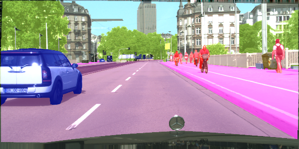

<html><head><meta content="text/html; charset=UTF-8" http-equiv="content-type"></head><body class="c20 c59"><h1 class="c30" id="h.sl8q8y4gq0tb">CarND-Path-Planning-Project</h1><h1 class="c30" id="h.3gc3ewas5i1j">Semantic Segmentation</h1><h3 class="c24" id="h.fjg11umz0i8q">Introduction</h3>
In this project, you&#39;ll label the pixels of a road in images using a Fully Convolutional Network (FCN).
<h3 class="c24" id="h.ch0qbzojsdsi">Setup</h3><h3 class="c24" id="h.kmmkbog2bz1y">Frameworks and Packages</h3>
Make sure you have the following is installed:
<ul class="c38 lst-kix_1rj01lbgs74w-0 start"><li class="c28"><a class="c23" href="https://www.google.com/url?q=https://www.python.org/&amp;sa=D&amp;ust=1522384927654000">Python 3</a></li><li class="c21"><a class="c23" href="https://www.google.com/url?q=https://www.tensorflow.org/&amp;sa=D&amp;ust=1522384927654000">TensorFlow</a></li><li class="c21"><a class="c23" href="https://www.google.com/url?q=http://www.numpy.org/&amp;sa=D&amp;ust=1522384927654000">NumPy</a></li><li class="c21"><a class="c23" href="https://www.google.com/url?q=https://www.scipy.org/&amp;sa=D&amp;ust=1522384927655000">SciPy</a></li></ul><h3 class="c24" id="h.h67a7u9i51oy">Dataset</h3>
Download the <a class="c23" href="https://www.google.com/url?q=http://www.cvlibs.net/datasets/kitti/eval_road.php&amp;sa=D&amp;ust=1522384927655000">Kitti Road dataset</a>&nbsp;from <a class="c23" href="https://www.google.com/url?q=http://www.cvlibs.net/download.php?file%3Ddata_road.zip&amp;sa=D&amp;ust=1522384927656000">here</a>. Extract the dataset in the data&nbsp;folder. This will create the folder data_road&nbsp;with all the training a test images.
<h2 class="c24" id="h.hu03jrh0lj2d">Run</h2>
Run the following command to run the project:

python main.py

To run this code you would need a GPU with at least 6GB of memory, because I did not have one with me I used <a class="c23" href="https://www.google.com/url?q=http://www.floydhub.com&amp;sa=D&amp;ust=1522384927657000">floyhub</a>.

To run the project under floydhub type this line in your command line after you upload your data road dataset and vgg model:

floyd run --gpu --env tensorflow-1.3 --data USERNAME/datasets/data_road/1:/data_road

--data USERNAME/datasets/pretrained_vgg/1:/pretrained_vgg &quot;python main.py&quot;

<h3 class="c42 c58" id="h.71c4ih173a6">Results</h3>
Does the project load the pretrained vgg model?

Function load_vgg is implemented correctly to load (see main.py ln54). It loads the model VGG from a SavedModel as specified by &nbsp;tags &lsquo;vgg16&rsquo; and it saves it in the specified path vgg_path and with tf.get_default_graph() we get the graph with the loaded context.

<table class="c32"><tbody><tr class="c44"><td class="c62" colspan="1" rowspan="1">
tf.saved_model.loader.load(sess, [&#39;vgg16&#39;], vgg_path)

graph = tf.get_default_graph()

image_input = graph.get_tensor_by_name(&#39;image_input:0&#39;)

keep_prob = graph.get_tensor_by_name(&#39;keep_prob:0&#39;)

layer3_out = graph.get_tensor_by_name(&#39;layer3_out:0&#39;)

layer4_out = graph.get_tensor_by_name(&#39;layer4_out:0&#39;)

layer7_out = graph.get_tensor_by_name(&#39;layer7_out:0&#39;)
</td></tr></tbody></table>

Does the project learn the correct features from the images?

The function layers is implemented correctly(see main.py ln78) as specified in the <a class="c23" href="https://www.google.com/url?q=https://people.eecs.berkeley.edu/~jonlong/long_shelhamer_fcn.pdf&amp;sa=D&amp;ust=1522384927660000">Fully Convolutional Networks for Semantic Segmentation</a>. In order for weights to be transposed convolution layers &nbsp;are implemented using tf.layers.conv2d. After a transpose layer I applied a skip technique by adding to the output of the upper layer. The purpose of the transpose layer to match upper layer shape so I can merge weights using tf.add. 
<table class="c32"><tbody><tr class="c44"><td class="c10" colspan="1" rowspan="1">
kernel_initializer = tf.truncated_normal_initializer(stddev=self.init_sd)

# 1x1 convolutions of the three layers

conv_7 = tf.layers.conv2d(vgg_layer7_out, num_classes, 1, 1, &nbsp;kernel_initializer=kernel_initializer, kernel_regularizer=kernel_regularizer)

conv_4 = tf.layers.conv2d(vgg_layer4_out, num_classes, 1, 1,

&nbsp; &nbsp; &nbsp; &nbsp; &nbsp; &nbsp; &nbsp; &nbsp; &nbsp; &nbsp; &nbsp; &nbsp; &nbsp;kernel_initializer=kernel_initializer, kernel_regularizer=kernel_regularizer)

conv_3 = tf.layers.conv2d(vgg_layer3_out, num_classes, 1, 1,

&nbsp; &nbsp; &nbsp; &nbsp; &nbsp; &nbsp; &nbsp; &nbsp; &nbsp; &nbsp; &nbsp; &nbsp; &nbsp;kernel_initializer=kernel_initializer, kernel_regularizer=kernel_regularizer)

&nbsp;# Upsample layer 7 and add to layer 4

# tf.layers.conv2d_transpose(inputs,filters,kernel_size,strides=(1, 1), padding=&#39;valid&#39;...)

input = tf.layers.conv2d_transpose(conv_7, num_classes, 4, 2, &#39;SAME&#39;,

&nbsp; &nbsp; &nbsp; &nbsp; &nbsp; &nbsp; &nbsp; &nbsp; &nbsp; &nbsp; &nbsp; &nbsp; &nbsp; &nbsp; &nbsp; &nbsp; &nbsp; kernel_initializer=kernel_initializer, kernel_regularizer=kernel_regularizer)

input = tf.add(input, conv_4)

# add to layer 3

input = tf.layers.conv2d_transpose(input, num_classes, 4, 2, &#39;SAME&#39;,

&nbsp; &nbsp; &nbsp; &nbsp; &nbsp; &nbsp; &nbsp; &nbsp; &nbsp; &nbsp; &nbsp; &nbsp; &nbsp; &nbsp; &nbsp; &nbsp; &nbsp; kernel_initializer=kernel_initializer, kernel_regularizer=kernel_regularizer)

input = tf.add(input, conv_3)

# Upsample the input and return

input = tf.layers.conv2d_transpose(input, num_classes, 16, 8, &#39;SAME&#39;,

&nbsp; &nbsp; &nbsp; &nbsp; &nbsp; &nbsp; &nbsp; &nbsp; &nbsp; &nbsp; &nbsp; &nbsp; &nbsp; &nbsp; &nbsp; &nbsp; &nbsp; kernel_initializer=kernel_initializer, kernel_regularizer=kernel_regularizer)
</td></tr><tr class="c44"><td class="c10" colspan="1" rowspan="1">

</td></tr></tbody></table>

To smooth out on the edges pixels I ran a series of test with kernel_regularizer and &nbsp;kernel_initializer. And as you can see in the images bellow kernel_regularizer did slightly better. 

<table class="c41"><tbody><tr class="c61"><td class="c52" colspan="2" rowspan="1">
The following images were taking at 30 epoch just to identified a good way to smooth pixel on the edges. The real training model was trained with 100 epochs 
</td></tr><tr class="c44"><td class="c3" colspan="1" rowspan="1">
With regularizer, no kernel_initialize
</td><td class="c22" colspan="1" rowspan="1">

</td></tr><tr class="c56"><td class="c3" colspan="1" rowspan="1">
With regularizer and kernel_initializer vector norms. 
</td><td class="c22" colspan="1" rowspan="1">

</td></tr><tr class="c56"><td class="c3" colspan="1" rowspan="1">
With kernel_initialize with vector norms, no regularizer
</td><td class="c22" colspan="1" rowspan="1">

</td></tr></tbody></table>

Does the project optimize the neural network?

The function optimize is implemented correctly. We compute the softmax cross entropy between logits and labels and use an Adam algorithm optimizer to minimize the cross entropy loss.

<table class="c32"><tbody><tr class="c44"><td class="c37" colspan="1" rowspan="1">
# Reshape logits for computing cross entropy

logits = tf.reshape(nn_last_layer, (-1, num_classes), name=&#39;logits&#39;)

# Compute cross entropy and loss

cross_entropy_logits = tf.nn.softmax_cross_entropy_with_logits(logits=logits, labels=correct_label)

# All regularization terms are added to a collection called tf.GraphKeys.REGULARIZATION_LOSSES,

# add the sum of all regularization losses to the previously calculated cross-entropy

cross_entropy_loss = tf.reduce_mean(cross_entropy_logits) + &nbsp;sum(tf.get_collection(tf.GraphKeys.REGULARIZATION_LOSSES))

# Training operation using the Adam optimizer

train_op = tf.train.AdamOptimizer(learning_rate).minimize(cross_entropy_loss)

</td></tr></tbody></table>

Does the project train the neural network?

The function train_nn is implemented correctly. The loss of the network is as shown below is printed while the network is training.

<table class="c9"><tbody><tr class="c44"><td class="c26" colspan="1" rowspan="1">
Below you can see the loss decreasing 
</td></tr><tr class="c44"><td class="c26" colspan="1" rowspan="1">

</td></tr></tbody></table>

Does the project train the model correctly?

On average, the model decreases loss over time

Does the project use reasonable hyperparameters?

In my case the optimal epoch I found with my model perform better using a batch size of 10 and loose was did not reduced after 100 epochs. 

Does the project correctly label the road?

The project labels most pixels of roads close to the best solution. The model doesn&#39;t have to predict correctly all the images, just most of them. As you can see in the images bellow this model is labeling more than 80% of the road and label no more than 20% of non-road pixels as road. 

<table class="c32"><tbody><tr class="c44"><td class="c40" colspan="1" rowspan="1">

</td><td class="c40" colspan="1" rowspan="1">

</td></tr><tr class="c44"><td class="c40" colspan="1" rowspan="1">

</td><td class="c40" colspan="1" rowspan="1">

</td></tr></tbody></table>

<h2 class="c14" id="h.kpumfxhu7sl8">References:</h2><ul class="c38 lst-kix_a102oay53e4d-0 start"><li class="c18 c48">Udacity Self-Driving Car  The link for the frozen VGG16 model is hardcoded into helper.py. The model can be found <a class="c23" href="https://www.google.com/url?q=https://s3-us-west-1.amazonaws.com/udacity-selfdrivingcar/vgg.zip&amp;sa=D&amp;ust=1522384927678000">here</a></li><li class="c18 c48">The model is not vanilla VGG16, but a fully convolutional version, which already contains the 1x1 convolutions to replace the fully connected layers. Please see this <a class="c23" href="https://www.google.com/url?q=https://discussions.udacity.com/t/here-is-some-advice-and-clarifications-about-the-semantic-segmentation-project/403100/8?u%3Dsubodh.malgonde&amp;sa=D&amp;ust=1522384927679000">forum post</a>&nbsp;for more information. A summary of additional points, follow.</li><li class="c18 c48">The original FCN-8s was trained in stages. The authors later uploaded a version that was trained all at once to their GitHub repo. The version in the GitHub repo has one important difference: The outputs of pooling layers 3 and 4 are scaled before they are fed into the 1x1 convolutions. As a result, some students have found that the model learns much better with the scaling layers included. The model may not converge substantially faster, but may reach a higher IoU and accuracy.</li><li class="c18 c48">When adding l2-regularization, setting a regularizer in the arguments of the tf.layers is not enough. Regularization loss terms must be manually added to your loss function. otherwise regularization is not implemented.</li></ul>
 
</body></html>