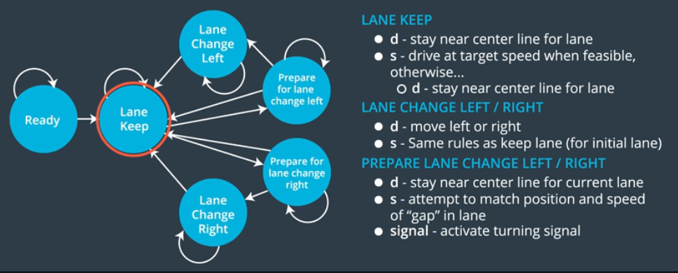
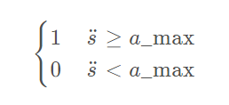
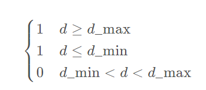
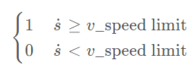
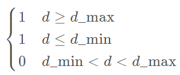
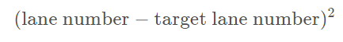

<html><head><meta content="text/html; charset=UTF-8" http-equiv="content-type"
</head><body class="c29"><h2 class="c6" id="h.291injm70153">Behavior Planning</h2>
Intro:

In this code above cover self driving car states machines:
<ol class="c15 lst-kix_yhbzk0mr0rox-0 start" start="1"><li class="c8">Keep lane</li><li class="c8">Change Lane right</li><li class="c8">Prep lane change left</li><li class="c8">Prep lane change right </li><li class="c8">Change lane left</li></ol>

<h2 class="c6" id="h.fqyoliujax40">Cost function</h2><h2 class="c6" id="h.lnp0d3dc6tb2">To help our decision making on what state to transit we generally use cost functions. Cost functions allow us to penalise bad transitions and to reward good posible transactions. Example:</h2>

Goald Distance Cost -Cost Increases based on distance of intended lane (for planning a lane change) and final lane of trajectory. Cost of being out of the goal lane becomes larger as vehicle approaches goal distance.

<table class="c27"><tbody><tr class="c11"><td class="c20" colspan="1" rowspan="1">

</td><td class="c25" colspan="1" rowspan="1"><ul class="c15 lst-kix_nopw90j1nuel-0 start"><li class="c8">&Delta;d&nbsp;was the lateral distance between the goal lane and the final chosen lane</li><li class="c8">&Delta;s&nbsp;was the longitudinal distance from the vehicle to the goal.</li></ul></td></tr></tbody></table>

Cost Code Example:

&nbsp; &nbsp;int&nbsp;delta_d = 2.0 * goal_lane - intended_lane - final_lane;  &nbsp; float&nbsp;cost = 1&nbsp;- exp(-(abs(delta_d) / distance_to_goal));  &nbsp; return&nbsp;cost;

Cost Table implemented: 
<table class="c27"><tbody><tr class="c11"><td class="c30" colspan="1" rowspan="1">
Penalizes trajectories that attempt to accelerate at a rate which is not possible for the vehicle.
</td><td class="c5" colspan="1" rowspan="1">
Penalizes trajectories that drive off the road.
</td></tr><tr class="c11"><td class="c30" colspan="1" rowspan="1">
Penalizes trajectories that exceed the speed limit.

</td><td class="c5" colspan="1" rowspan="1">
Penalizes trajectories that do not stay near the center of the lane.

</td></tr><tr class="c3"><td class="c28" colspan="2" rowspan="1">

Rewards trajectories that stay near the target lane.

</td></tr></tbody></table>

</body></html>