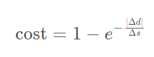

# AI_notes
This is a place I would be storing my AI research and notes 
<html><head><meta content="text/html; charset=UTF-8" http-equiv="content-type"></head><body class="c8">

Cost function

&Delta;d&nbsp;was the lateral distance between the goal lane and the final chosen lane

&Delta;s&nbsp;was the longitudinal distance from the vehicle to the goal.

&nbsp; &nbsp;int&nbsp;delta_d = 2.0 * goal_lane - intended_lane - final_lane;  &nbsp; float&nbsp;cost = 1&nbsp;- exp(-(abs(delta_d) / distance_to_goal));  &nbsp; return&nbsp;cost;

</body></html>